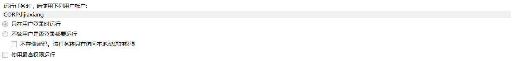
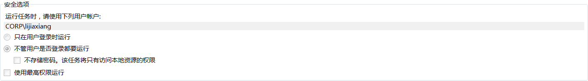

# taskscheduleR addin

`taskscheduleR`包也出了相关addin，但是执行报错，见[Github
Issue](https://github.com/bnosac/taskscheduleR/issues/61)。

    Warning: Error in observeEventHandler: Make sure the RscriptRepository does not contain spaces, change argument C:/Program Files/R/R-3.5.1/library/taskscheduleR/extdata to another location on your drive which contains no spaces

# log out

需要额外的设定，使得任务在未登录时，也可以执行，参考[Github
Issue](https://github.com/bnosac/taskscheduleR/issues/44)，加入`schtasks_extra
= '/RU CORP\\lijiaxiang /RP ******'`

在R执行以下代码，查看是否选择对应功能，在登出情况依然可以定时执行job

``` r
system("control schedtasks")
```

``` r

```

<!-- -->

``` r

```

<!-- -->

# 高频查看更新

HUE在每分钟查看记录时，会延迟，不展示最新记录，因此建议使用RODBC包函数查询，进行测试。

``` r
sqlQuery(impala,"
select *
from opd.t181228_schedule_task_test_ljx
order by inserttime desc
         ")
```

# R跑脚本的CMD命令

参考 [Stack
Overflow](https://stackoverflow.com/questions/18306362/run-r-script-from-command-line)
\> If you want the output to print to the terminal it is best to use
Rscript

``` shell
$ Rscript test.R
[1] 1
```

    R CMD BATCH test.R
    cat test.Rout
